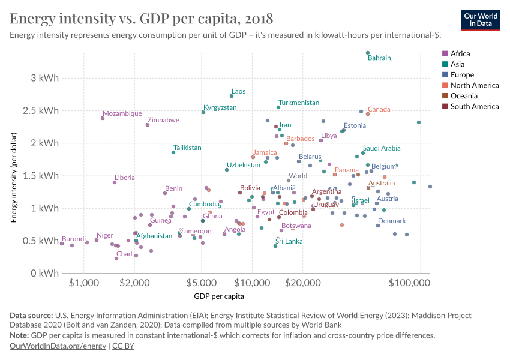
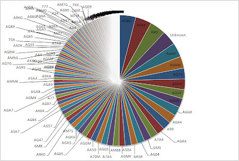

```{r setup, include=FALSE}
## **DO NOT EDIT THIS CODE CHUNK**
knitr::opts_chunk$set(echo = TRUE)

#run install.packages("cherryblossom") on the console to get the run17 dataset

library(tidyverse)
library(cherryblossom)  
```


## Exercise 1

```{r ex1a, out.width="80%"}
run17 %>%
  filter(event == "10 Mile") %>%
  ggplot(mapping = aes(x = age)) +
    geom_histogram(binwidth = 2)
```


_The overall shape of the histogram is right skewed_
_The structure shows the age of runners of 10 miles mostly is between 20 and 40_
_the median of the histogram is 35 years old_

```{r ex1b, out.width="80%"}
# 
run17 %>%
  filter(event == "5K") %>%
  ggplot(mapping = aes(x = age)) +
    geom_histogram(binwidth = 2)
```


_The shape of the histogram is also positive skewed._
_The similarity of the age distribution between the "5K" and "10 Mile"races is that they have similar shape._
_The difference between them is that the age distribution of the 5K has many small peaks, but the age distribution of the 10 mile doesn't have._


## Exercise 2

```{r ex2, out.width = "80%"}
# 
  run_10mile<-filter(run17, event == "10 Mile")
  ggplot(run_10mile, aes(x = sex, y = clock_sec, fill = net_sec)) +
   geom_boxplot() +
   labs(title = "Time Taken to Complete Cherryblossom Race",
       y = "Time (minutes)",
       x = "Gender") +
  theme_minimal() +
  theme(legend.position = "none")
  run_5K<-filter(run17, event == "5K")
  ggplot(run_10mile, aes(x = sex, y = clock_sec, fill = net_sec)) +
   geom_boxplot() +
   labs(title = "Time Taken to Complete Cherryblossom Race",
       y = "Time (minutes)",
       x = "Gender") +
  theme_minimal() +
  theme(legend.position = "none")
```
_The male use less time for running the same distance than the female commonly._


## Exercise 3

```{r ex3, out.width = "80%"}
# 
Firstwave<-filter(run17, event == "10 Mile", clock_sec-net_sec<=180)
Lastwave<-filter(run17, event == "10 Mile", clock_sec-net_sec>=1380)
Run <- bind_rows(Firstwave,Lastwave)
Run2 <- mutate(Run, wave =
    case_when(clock_sec - net_sec <= 180 ~'First wave',
              clock_sec - net_sec >= 1380 ~ 'Last wave'))

ggplot(data = Run2, mapping = aes (x = age,y = clock_sec/60, colour = wave))+
 geom_point (alpha = 0.4) + 
   scale_y_continuous(breaks = c(60,80,100,120,140)) +
geom_smooth(method = lm, se = FALSE) +
   labs (x ="Runners Age, in years", 
        y = "Race time, in minutes", 
        title = "scatter Plot of 10 Mile Race, Time Against Age", 
        subtitle = "First vs Last Wave", 
        Colour = NULL) +
   scale_color_manual(values = c('First wave' = "orange", 
                                 'Last wave'= "forestgreen")) +
     theme_bw() +
     theme(legend.position = "bottom")
```


## Exercise 4

#### Example of a good data visualisation

```{r ex4_good_viz, echo = FALSE, out.width = "80%"}
# edit the file path accordingly

```

**Our World in Data**, "*Our world in Data**" [Online]. Available at: **https://ourworldindata.org/grapher/energy-intensity-vs-gdp** (Accessed: **07 10 2023**)


The above image presents a good data visualisation because:

-   _It conveys information clearly and concisely. Avoid clutter and unnecessary elements that can distract from the main message. Use clear labels, appropriate color schemes, and intuitive layouts to ensure that the audience can easily interpret the data._
-   _It provides context and transparency about data sources, methods, and without any potential biases or limitations._

#### Example of a bad data visualisation


```{r ex4_bad_viz, echo = FALSE, out.width = "80%"}
# edit the file path accordingly

```

_ **Catherine**, "**Yum - A Million Pieces of Pie!**" [Online]. Available at: **https://playfairgroup.blogspot.com/2010/09/yum-million-pieces-of-pie.html** (Accessed: **15 09 2010**)_


The above image presents a bad data visualisation because:

-   _While it has been established that using different colors help people interpret data visualizations quicker, too much color can confuse the viewer. It is important to choose a limited number of colors._
-   _A pie chart was the wrong choice. A bar chart might be a better choice for this data._


